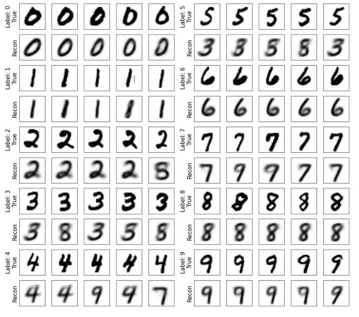

# Variational Autoencoder

## EuiYul Song (20214426)
## Experimental setting (train epoch, model parameter, etc.)

After building the model aligned with the assignment specification, I trained the model with the dafult setting provided by the TAs (e_hidden, d_hidden = 500; epoch = 20). However, the model seemed to mis-classify some numbers without any pattern. Thus, I concluded that this misclassification came from under-fitting.

Thereby, I increased the model's epoch to 200. As a result, the model produced lesser number of incorrect labels than the first trial did. However, I discovered a pattern that this model can not distinguish the labels with similar shape, meaning the model is still underfitted. 

Lastly, I increased the model's epoch to 500 in order to prevent underfitting. I also refined e_hidden and d_hidden to 256 so as to prevent overfitting. The result as a success that I was able to observe few misclassifications.

## 5 Reconstruction images per each class.

## Visualization of the 2D latent space.

